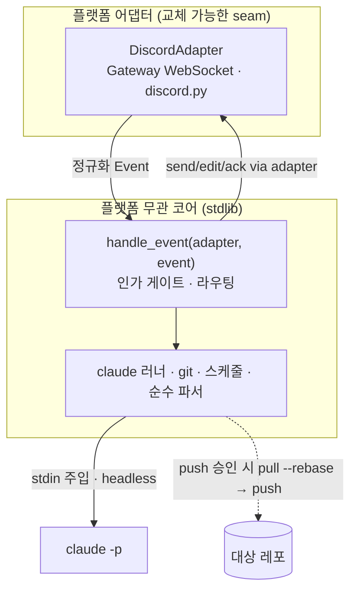

# claude_bridge

**디스코드에서 보낸 한 줄로 Claude Code 를 원격 실행하는 디스코드 실행비서.**
PC 앞에 없어도 디스코드에 지시를 보내면 상시 호스트가 대신 작업하고,
커밋은 `push` 로 승인했을 때만 원격에 올린다. 봇 프레임워크 없이 **플랫폼 무관 코어 +
어댑터 계층**으로 설계해, 메신저·호스트를 갈아끼울 수 있는 구조를 유지한다(현재 구현: 디스코드).


<!-- 스크린샷: (추후) — 현재는 아래 아키텍처 다이어그램으로 대체 -->

## 아키텍처 — 플랫폼 무관 코어 + 어댑터



코어는 **`Adapter` 계약**(poll·send·edit·ack·fetch_file·close + 채널 헬퍼)과 2개 정규화
dataclass(`Event`·`Button`)만 안다. 디스코드 이벤트는 어댑터가 `Event` 로 정규화하고, 코어의
`Button` 리스트를 플랫폼 UI(discord View)로 렌더한다. 이 인터페이스가 **플랫폼 교체 seam** —
다른 메신저로 바꾸려면 어댑터 1개만 새로 쓰면 되고 코어는 그대로다. **외부 의존성은 `discord.py`
하나뿐이며 `discord_adapter.py` 한 파일에만 격리**된다 — 코어(`bridge.py`·`adapter.py`)는 표준
라이브러리 전용이라, 어댑터를 지연 import 하는 경로(셀프테스트·단위 테스트)는 discord.py 없이도 돈다.

디스코드 수신은 상시 WebSocket(Gateway)이고, 코어는 **단일 워커의 직렬 루프**다. 어댑터가
asyncio(이벤트루프 스레드) ↔ 동기 코어(워커 스레드)를 큐 + `run_coroutine_threadsafe` 로 이어
"한 번에 하나" 불변식을 지킨다. 인바운드 포트를 열지 않는다(전부 아웃바운드) — 상시 호스트의
공격면을 최소화한다.

## 주요 기능

| 기능 | 설명 |
|---|---|
| **채널 = 프로젝트** | 봇이 프로젝트별 채널을 자동 생성. `#etf_info` 채널에서 프로젝트명 없이 지시만 보내면 그 프로젝트에서 실행 |
| **상태색 임베드** | 완료 초록 · 실패 빨강 · 진행 노랑 · 확인대기 블러플. 진행→완료는 같은 메시지를 편집(채널이 안 쌓임) |
| **버튼 UI** | 프로젝트 선택·`push` 승인·예약알림 확인을 탭 버튼으로 — 폰 타이핑 최소화 |
| **한글·평문 명령** | `프로젝트`·`도움말`·`취소`·`재시작` 을 단독 단어로(슬래시 `/프로젝트`·영어 별칭도) |
| **승인형 push** | 로컬 커밋까지만 자동, 원격 반영은 `push` 승인(또는 버튼)으로 명시 |
| **`재시작`** | 봇이 자기 코드를 고친 뒤 디스코드에서 재시작 → 재기동 런처(로컬)/systemd(VM)가 자동 복구, 복귀 알림 |
| **예약 알림** | 지정 시각에 브리지가 먼저 #알림 채널에 알림 → 확인 탭 시 **읽기 전용** 점검 실행 |
| **사진 대조** | 증권 캡처를 보내면 로컬 REST 값과 대조(멀티모달 수신, CDN 도메인 고정) |

## Why — 왜 만들었나

**문제**: 외출 중에도 "이 버그 고쳐줘" 한 줄을 처리하고 싶다. 그런데 원격 코드 실행·커밋은
그 자체로 위험한 표면이고, 개인 기기는 공개 엔드포인트가 없다.

**해결**: 봇 프레임워크 없이 **어댑터 패턴**으로 플랫폼 무관 코어를 짜서, 메신저와 호스트(노트북↔
클라우드 VM)를 자유롭게 갈아끼울 수 있게 했다. 원격 실행 표면은 신원 게이트·인젝션 방어·최소
권한으로 다층 방어하고, **인바운드 포트 0**(아웃바운드 전용)으로 노출면을 최소화한다. 개인 원격
도구에 맞춰 **운영 표면을 최소화**하는 것이 최우선 가치다.

## 보안 설계 (기술적 트레이드오프)

원격에서 코드를 실행·커밋하는 표면이라 방어를 다층으로 둔다. 결정 근거는
[의사결정 기록(ADR)](docs/개발/의사결정/) 참조.

| 경계 | 방어 | 트레이드오프 |
|---|---|---|
| **신원 게이트** | 허용 유저 ID(`DISCORD_ALLOWED_USER_IDS`) 목록 필수 — 밖은 무회신·로그만. 빈 목록이면 기동 거부 | 봇은 공개 검색·초대될 수 있음 → 허용목록이 유일 방벽. 1인 비공개 서버 운용 권장 |
| **명령 인젝션(RCE)** | 사용자 입력을 argv 에 두지 않고 **stdin 으로만** claude 에 전달 | Windows `claude.CMD` shim 의 `cmd.exe` 재파싱을 stdin 전용으로 원천 차단 |
| **최소 권한** | 경로별 `--allowedTools` 3티어 — 작업(편집+git)·점검(읽기+검증)·사진(읽기만). 일반 셸·`git push` 미부여 | 사진 속 악성 텍스트가 커밋으로 상승하는 confused-deputy 차단 |
| **파일 다운로드** | 사진 URL 도메인 고정(디스코드 CDN 화이트리스트)·확장자·10MB·경로 트래버설 차단·리다이렉트 미추종 | 임의 URL 다운로드·내부망(SSRF) 접근 차단 |
| **비밀값** | 봇 토큰·인가키는 `.env` 로만(커밋 금지). 회신·로그에서 토큰·내부 경로 마스킹 | — |
| **푸시 통제** | 로컬 커밋까지만 자동, 원격 반영은 사용자 승인 시 `pull --rebase` 후 | claude 에는 push 권한 없음 |
| **단일 인스턴스** | pidfile 락 — 같은 봇을 두 곳에서 구동하면 Gateway 세션 충돌 | 브리지는 한 호스트에서만 실행 |

## Quick Start

```bash
git clone <repo> && cd claude_bridge
python -m pip install -r requirements.txt   # discord.py
cp .env.example .env                        # 봇 토큰·인가키 채우기
python bridge.py                            # 또는 run_loop.ps1(재기동 루프)
```

`.env` 에 `DISCORD_BOT_TOKEN` 과 `DISCORD_ALLOWED_USER_IDS` 를 채운 뒤 실행한다.
디스코드에서 `도움말` 로 시작.

## 환경 변수 (`.env`)

`.env.example` 을 복사해 채운다. **실제 토큰·ID 는 커밋 금지** — 아래는 이름·형식만.

| 변수 | 설명 |
|---|---|
| `DISCORD_BOT_TOKEN` | 디스코드 봇 토큰 |
| `DISCORD_ALLOWED_USER_IDS` | 허용 유저 ID(콤마 구분) |
| `CLAUDE_TIMEOUT_SEC` | claude 작업 1건 최대 실행 시간(초, 기본 900) |
| `TARGET_ROOT` | 원격 지시 대상 프로젝트 루트(직속 폴더만) |

## 호스팅

브리지는 상시 프로세스라 **켜 두는 동안만** 원격이 동작한다.

- **로컬(노트북)**: `run_loop.ps1`(Windows PowerShell 재기동 루프 — `재시작`·크래시 자동 복구).
  절전 해제 필수(잠자면 수신 중단).
- **클라우드 VM**: `systemd`(`Restart=always`) 로 상시 구동 → 호스트 기기를 꺼도 동작.
  Gateway 는 아웃바운드라 공개 포트·포트포워딩이 필요 없다.

## 개발

```bash
python -m pytest             # 단위·계약 테스트(순수 함수·FakeAdapter, 네트워크 없음)
ruff check . && ruff format --check .
mypy .
python bridge.py --selftest  # 순수 함수 스모크(보안 경계 포함)
```

코어(`bridge.py`)·계약과 공유 유틸(`adapter.py`)·어댑터(`discord_adapter.py`)로 분리돼 있고,
파싱·허용목록·경로 해석·마스킹·콜백 코덱 등 순수 함수와 어댑터 계약이 테스트로 고정된다.

## 문서

- **아키텍처**: [docs/개발/아키텍처.md](docs/개발/아키텍처.md)
- **의사결정(ADR)**: [docs/개발/의사결정/](docs/개발/의사결정/) — 단일루프·stdin 인젝션 방어·3티어 권한·stream-json
- **어댑터 계층**: [docs/기능/디스코드_이관/](docs/기능/디스코드_이관/) — 어댑터 설계·계약·UX
